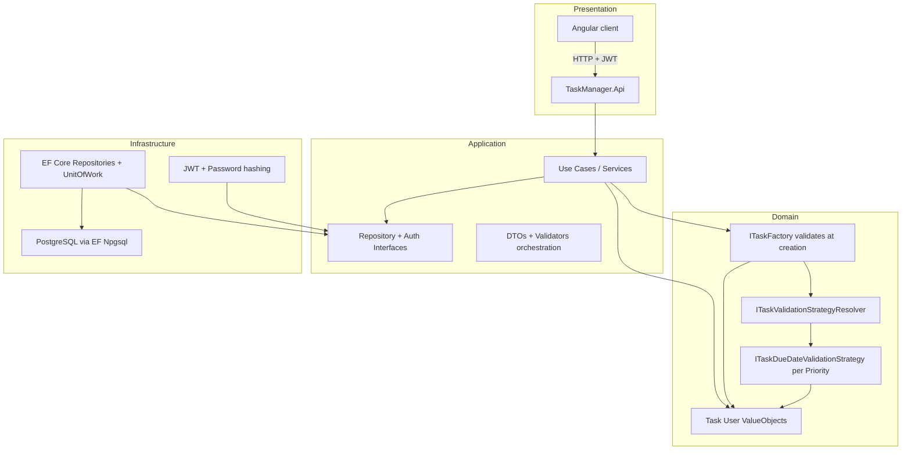
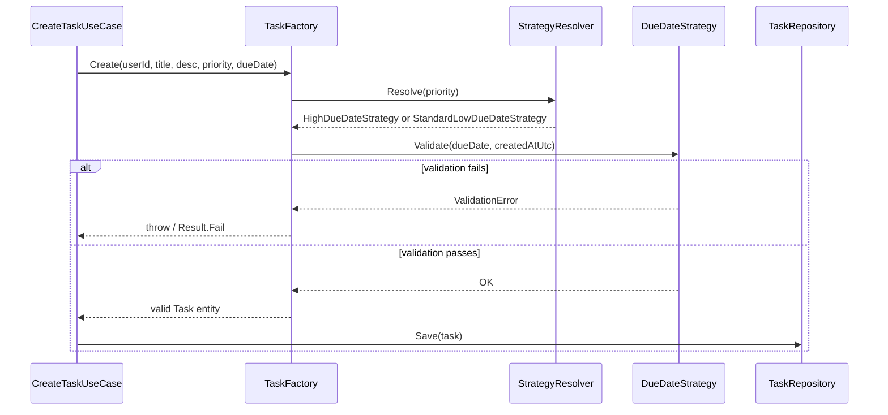
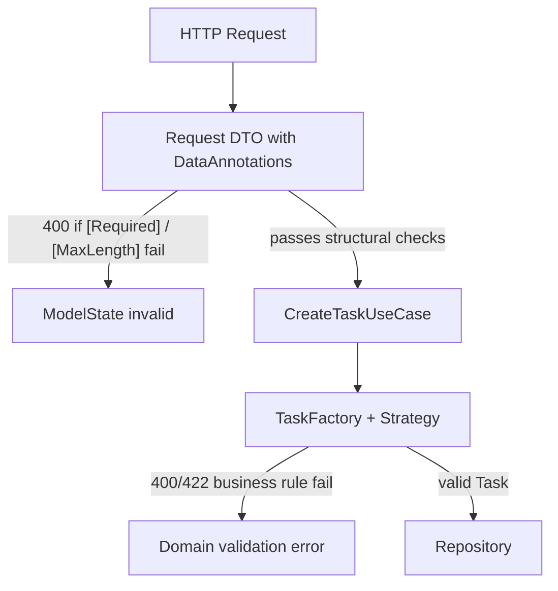
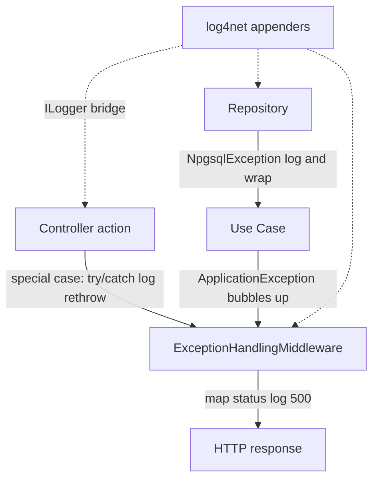
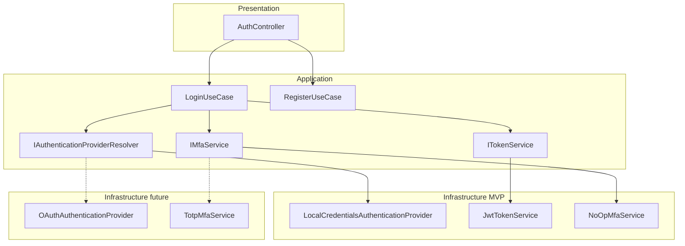
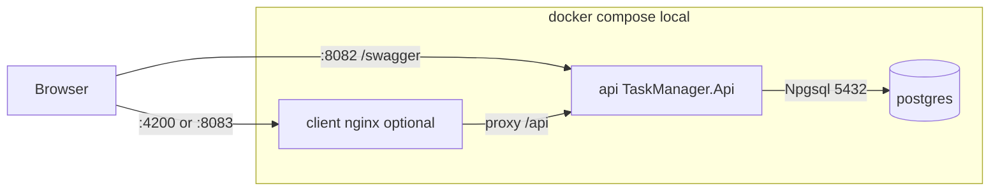
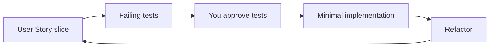
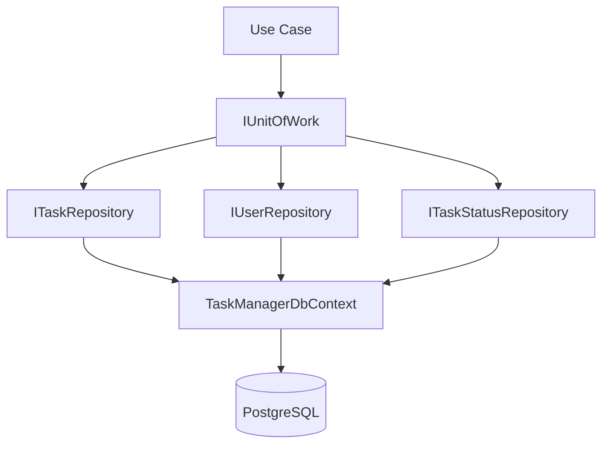

> **Plan sync (keep both files identical):**
> - **Cursor Plans UI:** `C:\Users\totar\.cursor\plans\task_manager_interview_plan_0b572b1a.plan.md`
> - **Repo (git):** `c:\repos\task-manager\.plans\task_manager_interview_plan_0b572b1a.plan.md`
>
> When editing the plan, update **both** paths in the same change.

# Task Manager Interview Project Plan

## Goal

Deliver a demo-ready **Task Management** app that satisfies the interview brief: CRUD tasks + user auth, Clean Architecture, TDD, **EF Core in Infrastructure (Phase 5) with Repository + Unit of Work**, **no Dapper / MediatR**, Angular frontend, seeded demo data, README, and a clear **GenAI + critical review** narrative for presentation.

**Data access note:** Phase 3 auth repos use ADO.NET as an interim slice. **Phase 5** consolidates all persistence behind **EF Core**, **Repository**, and **Unit of Work** — Domain and Application remain ORM-free (interfaces only). Be ready to explain this trade-off in the panel if the written brief still says “no EF.”

## Your Cursor Skills (already in repo)

Use these **before each work session** — reference them explicitly in prompts:

| Skill | When to invoke |
|-------|----------------|
| [`.cursor/skills/task-manager-clean-architecture/SKILL.md`](.cursor/skills/task-manager-clean-architecture/SKILL.md) | All backend/TDD/architecture work |
| [`.cursor/skills/frontend-design/SKILL.md`](.cursor/skills/frontend-design/SKILL.md) | Angular UI pages and styling |
| [`.cursor/skills/devops-docker/SKILL.md`](.cursor/skills/devops-docker/SKILL.md) | `Dockerfile`, `docker-compose.yml`, CI |

**Recommended Cursor prompt prefix** for every feature:

> Read and follow `.cursor/skills/task-manager-clean-architecture/SKILL.md`. TDD only: write failing xUnit tests first; wait for my approval before implementation.

**Skill tweak (when starting Phase 5):** Update [`.cursor/skills/task-manager-clean-architecture/SKILL.md`](.cursor/skills/task-manager-clean-architecture/SKILL.md) to document **EF Core + Repository + Unit of Work** in Infrastructure (replace ADO.NET-only wording), Npgsql provider, and the PM user story with priority-based Strategy rules.

---

## User Story (for presentation)

Use this verbatim in the README and open the demo with it:

> **As a Project Manager handling tight deadlines**, I want to **create and track tasks with automatic, priority-based rules**, **so that I can securely manage my daily workload and ensure high-urgency tasks are validated with stricter deadlines.**

### Acceptance Criteria (the "why" behind the code)

#### 1. Secure Access
- Users must **log in** to see or modify tasks.
- Tasks belong to a **specific user** and cannot be accessed by others (403/404 on cross-user access).
- Demo: login as User A → attempt User B's task ID → rejected.

#### 2. Dynamic Behavior (Strategy Pattern)
Priority drives **due-date validation rules** at create and update time:

| Priority | Due-date rule |
|----------|---------------|
| **High** | Must be due **within 48 hours** from the moment of creation (strict operational constraint) |
| **Standard / Low** | Any **future** due date, up to **1 year** from creation |

- Selecting a strategy is based on `TaskPriority` — no giant if/else in use cases.
- Demo: create High-priority task with due date 72h out → validation error; Standard with valid future date → success.

#### 3. Immutability & Integrity (Factory Pattern)
- A task **can never exist in an invalid state**.
- It must be **fully validated at the exact second of creation** — the Factory is the only gate that materializes a `Task` entity.
- If validation fails, **no entity is returned** (exception/`Result` failure); nothing is persisted.
- Demo: show unit test proving Factory rejects invalid input before any repository call.

### Live demo checklist
- Register → login → receive JWT → CRUD tasks scoped to logged-in user
- Create **High** task within 48h → success; beyond 48h → rejected with clear message
- Create **Standard/Low** task with future date within 1 year → success; beyond 1 year → rejected
- One **authorized** endpoint (`/api/tasks`, `/api/me`) and one **anonymous** endpoint (`/api/health`)
- Seeded demo PM user + mixed-priority sample tasks

---

## Solution Structure

```text
task-manager/
├── .cursor/skills/           # already present
├── src/
│   ├── TaskManager.Domain/
│   ├── TaskManager.Application/
│   ├── TaskManager.Infrastructure/
│   └── TaskManager.Api/
├── tests/
│   ├── TaskManager.Domain.Tests/
│   ├── TaskManager.Application.Tests/
│   ├── TaskManager.Infrastructure.Tests/
│   └── TaskManager.Api.Tests/
├── client/                   # Angular app
├── db/
│   └── init.sql              # schema + seed data (mounted into Postgres on first start)
├── docker-compose.yml        # Local full-stack: postgres + api (+ client in Phase 8)
├── Dockerfile                # API multi-stage build
├── Dockerfile.client         # Optional — Angular build + nginx (Phase 8)
├── .dockerignore
├── .env.example              # POSTGRES_*, JWT_*, API port — copy to .env locally
└── README.md
```

### Dependency flow (Clean Architecture)



---

## Design Patterns — Factory + Strategy Flow

The user story maps cleanly to two patterns with a **single creation pipeline**:



### 1. Factory Pattern — validated creation gate

**Where:** `TaskManager.Domain` — `ITaskFactory` / `TaskFactory`

**Responsibility:** The **only** code path that instantiates a `Task`. It orchestrates validation and applies defaults so no invalid task can exist.

**Flow:**
1. `CreateTaskUseCase` receives `CreateTaskCommand` (title, description, priority, dueDate)
2. `TaskFactory.Create(...)` captures `createdAtUtc = DateTime.UtcNow` (single timestamp for all rules)
3. Factory resolves the correct due-date strategy via `ITaskValidationStrategyResolver`
4. Strategy validates due date against priority rules (48h vs 1yr)
5. Factory validates invariants (non-empty title, etc.)
6. **Only then** returns a fully valid `Task` with defaults (`StatusId` = Todo from lookup / `TaskStatus.Todo`; audit fields set by use case or repository — see Audit columns below)
7. Use case persists via repository

```csharp
// Conceptual — tests written first
public interface ITaskFactory
{
    TaskItem Create(
        Guid userId,
        string title,
        string description,
        TaskPriority priority,
        DateTime dueDate,
        DateTime? createdAtUtc = null); // injectable in tests for deterministic 48h/1yr boundaries
}
```

**Interview talking point:** *"The Factory is a creation gate — if it returns a Task, you know it was valid at that exact second."*

### 2. Strategy Pattern — priority-based due-date rules

**Where:** `TaskManager.Domain` — one interface, two concrete strategies, one resolver

| Type | Class | Rule |
|------|-------|------|
| Interface | `ITaskDueDateValidationStrategy` | `ValidationResult Validate(DateTime dueDate, DateTime createdAtUtc)` |
| High | `HighPriorityDueDateStrategy` | `dueDate > createdAtUtc` AND `dueDate <= createdAtUtc + 48 hours` |
| Standard/Low | `StandardLowPriorityDueDateStrategy` | `dueDate > createdAtUtc` AND `dueDate <= createdAtUtc + 1 year` |
| Resolver | `ITaskValidationStrategyResolver` | Maps `TaskPriority.High` → High strategy; `Standard`/`Low` → StandardLow strategy |

**Update path:** On `UpdateTaskUseCase`, when priority or due date changes, re-run the same strategy against the task's **`CreatedOn`** (creation moment is the anchor for the 48h/1yr window — never `UpdatedOn`; document this in README so the panel understands the rule). Set **`UpdatedBy`** and **`UpdatedOn`** on every successful update.

**Optional add-on (only if time):** Status transition validation on update (Todo → InProgress → Done) using `TaskStatuses` lookup — defer to avoid scope creep.

**Presentation one-liner:** *"Strategy encapsulates priority-specific deadline rules; Factory ensures those rules run before any Task exists."*

---

## Validation Layers (two-tier — Data Annotations on DTOs only)

Validation is split so patterns stay in the **Domain** and HTTP plumbing stays in **Presentation**:



| Layer | Mechanism | Examples | Purpose |
|-------|-----------|----------|---------|
| **Presentation (DTOs)** | `[Required]`, `[MaxLength]`, `[EmailAddress]` on request models | `CreateTaskRequest`, `RegisterRequest` | Reject malformed HTTP input early; ASP.NET `[ApiController]` auto-returns 400 |
| **Domain** | Strategy + Factory | 48h / 1yr due-date rules, non-empty title invariants | Business rules independent of API and data layer |

**Rules:**
- **Do not** put Data Annotations on Domain entities (`Task`, `User`) — keeps the business logic layer free of presentation attributes.
- **Do not** duplicate priority/due-date rules in DTO annotations — those belong exclusively in Strategy/Factory (single source of truth).
- Map DTO → command in the controller, then call the use case; Factory enforces business rules.

**Example DTO annotations (Presentation only):**

```csharp
public sealed class CreateTaskRequest
{
    [Required]
    [MaxLength(200)]
    public string Title { get; init; } = string.Empty;

    [MaxLength(2000)]
    public string? Description { get; init; }

    [Required]
    public TaskPriority Priority { get; init; }

    [Required]
    public DateTime DueDate { get; init; }
}
```

**Interview talking point:** *"Data Annotations guard the API contract; Strategy and Factory enforce business rules the interview cares about."*

**Route / query single-value parameters:** When an endpoint accepts only one bound value (e.g. task `id` from route), use explicit binding + constraints — not a full body DTO:

```csharp
[HttpGet("{id:guid}")]
public async Task<ActionResult<TaskResponse>> GetById(
    [FromRoute][Required] Guid id,
    CancellationToken cancellationToken)
```

Use `[FromQuery]` with `[Required]` / `[EmailAddress]` / `[MaxLength]` for single query params (e.g. optional filters). Use `[FromBody]` for JSON request models (`CreateTaskRequest`, `LoginRequest`).

---

## Error Logging (log4net) & Exception Handling

**Goal:** Structured error logging for operations and debugging without duplicating HTTP status mapping in every controller. Keep the existing global [`ExceptionHandlingMiddleware`](src/TaskManager.Api/Middleware/ExceptionHandlingMiddleware.cs) as the **last line of defense**; add **log4net** as the logging backend and **targeted try/catch** only where extra context or security-sensitive logging is needed.



### log4net setup (API project)

| Item | Detail |
|------|--------|
| **Packages** | `log4net`, `Microsoft.Extensions.Logging.Log4Net.AspNetCore` on [`TaskManager.Api`](src/TaskManager.Api/TaskManager.Api.csproj) |
| **Config** | [`log4net.config`](src/TaskManager.Api/log4net.config) at API project root — copy to output (`CopyToOutputDirectory`) |
| **Appenders** | `ConsoleAppender` (dev); `RollingFileAppender` → `logs/taskmanager-.log` (date roll, size cap) |
| **Levels** | Root `INFO`; `TaskManager` namespace `DEBUG` in Development; `WARN`+ always to file |
| **Registration** | [`Program.cs`](src/TaskManager.Api/Program.cs): `builder.Logging.AddLog4Net("log4net.config");` (optionally `ClearProviders()` in Production so log4net is primary) |
| **Usage** | Inject `ILogger<T>` everywhere (controllers, middleware, repositories) — log4net backs `ILogger` via the bridge |

**Do not log:** passwords, JWTs, refresh tokens, full connection strings, or raw request bodies on auth endpoints.

### Layer responsibilities

| Layer | Responsibility |
|-------|----------------|
| **Middleware** | Catch unhandled exceptions; map typed application exceptions → 4xx; unknown → 500 + **Error** log (extend existing middleware — no second mapper) |
| **Controllers** | **No** generic catch-all per action. try/catch only for **special scenarios** below; **rethrow** so middleware keeps a single HTTP mapping |
| **Use cases** | Throw typed `Application.Exceptions.*`; no HTTP or logging concerns |
| **Repositories** | try/catch around EF/DB failures (`DbUpdateException`) for **infrastructure failures** only |

### Controller try/catch — special scenarios only

Pattern: log with context, then `throw;` (do not return a different status from catch unless explicitly required).

| Scenario | Controller | Log level | Context to include |
|----------|--------------|-----------|-------------------|
| Failed login | `AuthController.Login` | `Warning` | email (not password), optional client IP |
| Failed register (duplicate) | `AuthController.Register` | `Warning` | email; middleware returns 409 |
| Task create/update domain rejection | `TasksController` Create/Update | `Information` | `userId`, `priority`, `dueDate`; rethrow → 400 |
| Unexpected error with route id | Actions with `[FromRoute] Guid id` | `Error` | `id`, `userId`, action name; rethrow → 500 |
| Health / anonymous | No try/catch | — | Middleware only |

**Example (login — audit without swallowing):**

```csharp
try
{
    var result = await _loginUseCase.ExecuteAsync(command, cancellationToken);
    return Ok(result);
}
catch (UnauthorizedApplicationException ex)
{
    _logger.LogWarning(ex, "Login failed for {Email}", request.Email);
    throw;
}
```

**Default for new actions:** no try/catch — rely on middleware. Add try/catch only when the table above applies.

### Repository try/catch (infrastructure)

| Scenario | Where | Action |
|----------|-------|--------|
| `DbUpdateException` / `NpgsqlException` (inner) | EF repositories / `EfUnitOfWork` | `LogError` with operation + entity id; wrap in safe `ApplicationException` (no connection string in message) |
| JWT misconfiguration | `JwtTokenService` | `LogCritical` + throw at startup/first use |

### Phase 3b — Logging retrofit (before or alongside Phase 4)

- Add packages + `log4net.config` + `Program.cs` registration
- Verify console + `logs/` output on `dotnet run`
- Ensure [`ExceptionHandlingMiddleware`](src/TaskManager.Api/Middleware/ExceptionHandlingMiddleware.cs) logs 500s via `ILogger` (log4net backend)
- Retrofit [`AuthController`](src/TaskManager.Api/Controllers/AuthController.cs): try/catch on login/register per table
- Document log path in [`README.md`](README.md); optional note in [`ARCHITECTURE.md`](ARCHITECTURE.md)

---

## Domain Model (minimum fields)

### Audit columns (all tables)

Every application table includes standard audit fields:

| Column (PostgreSQL) | C# property | Set on create | Set on update |
|---------------------|-------------|---------------|---------------|
| `created_by` | `CreatedBy` | Current user `Guid` (JWT subject) | Never changed |
| `created_on` | `CreatedOn` | `DateTime.UtcNow` | Never changed |
| `updated_by` | `UpdatedBy` | Same as `CreatedBy` | Current user `Guid` |
| `updated_on` | `UpdatedOn` | Same as `CreatedOn` | `DateTime.UtcNow` |

**Where populated:** Application use cases (or a thin repository helper) — not the Factory. Factory sets business fields only; **`CreatedOn`** doubles as the strategy anchor timestamp passed to due-date validation.

**Register edge case:** On user self-registration, set `CreatedBy` / `UpdatedBy` to the new user's own `Id` after insert (or use a single transaction with generated id).

**API responses:** Include audit fields in `TaskResponse` (optional in list, full detail on GET by id) — useful for demo and panel questions.

### Users table
- `Id` (UUID PK)
- `Email` (unique)
- `Name` (required display name)
- `Alias` (optional unique handle / username for display)
- `PasswordHash` (nullable — **null for future OAuth-only users** linked via external login)
- `RoleId` (FK → `roles.Id`)
- `IsActive` (bool, default `true` — inactive users cannot log in)
- `EndDate` (nullable `timestamptz` — account expiry; login rejected if `EndDate < UtcNow`)
- `LastLoginDate` (nullable `timestamptz` — updated on each successful login)
- `MfaEnabled` (bool, default `false` — column present now; MFA flow stubbed until implemented)
- `CreatedBy`, `CreatedOn`, `UpdatedBy`, `UpdatedOn`

**Login business rules:** After credentials validate, reject if `IsActive == false` or `EndDate` is in the past; on success set `LastLoginDate = UtcNow` via repository.

**Register defaults:** `IsActive = true`, `EndDate = null`, `RoleId` = default role (e.g. Project Manager), `LastLoginDate = null`.

### Roles table (supports `RoleId`)
- `Id` (int or UUID PK — use **int** for simple seed data)
- `Name` (unique, e.g. `ProjectManager`, `Admin`)
- `CreatedBy`, `CreatedOn`, `UpdatedBy`, `UpdatedOn`

**Seed roles:** `ProjectManager` (default for self-registration), `Admin` (demo panel account optional).

**Future (not MVP — document in README):** `user_external_logins` table (`user_id`, `provider`, `provider_subject`, audit columns) for OAuth account linking.

### TaskStatuses table (supports task lifecycle)
- `Id` (int PK)
- `Name` (unique, e.g. `Todo`, `InProgress`, `Done`)
- `Description` (optional short label for UI)
- `SortOrder` (int — display order in dropdowns)
- `IsActive` (bool, default `true` — inactive statuses hidden from assignment)
- `CreatedBy`, `CreatedOn`, `UpdatedBy`, `UpdatedOn`

**Seed statuses:** `Todo` (default on create), `InProgress`, `Done`.

**Domain mapping:** Keep a `TaskStatus` enum (or constants) in Domain for business logic; Infrastructure maps `StatusId` ↔ enum via `ITaskStatusRepository` or static lookup. API returns both `statusId` and `statusName` in `TaskResponse`.

### Tasks table
- `Id` (UUID PK)
- `UserId` (FK → Users)
- `Title`
- `Description`
- `StatusId` (FK → `task_statuses.Id` — replaces inline enum column)
- `Priority` (enum: **High**, **Standard**, **Low**)
- `DueDate`
- `CreatedBy`, `CreatedOn`, `UpdatedBy`, `UpdatedOn`

**Seed data suggestion:** PM demo user (`Name`: "Demo PM", `Alias`: "demo-pm", role: ProjectManager) with one High task (due tomorrow), one Standard task (due next month), one Low task (due in 6 months).

---

## API Surface

### Auth (`/api/auth`) — MVP + extension points

| Method | Route | Auth | Purpose | MVP |
|--------|-------|------|---------|-----|
| POST | `/register` | No | Create local user | Yes |
| POST | `/login` | No | Authenticate; returns JWT or MFA challenge | Yes (JWT only) |
| POST | `/mfa/verify` | No | Complete login after MFA challenge | Stub (501 or documented future) |
| GET | `/oauth/{provider}/login` | No | Redirect to OAuth provider | Stub (future) |
| GET | `/oauth/{provider}/callback` | No | OAuth callback | Stub (future) |

**Login request (extensible):**

```csharp
public sealed class LoginRequest
{
    [Required]
    [EmailAddress]
    public string Email { get; init; } = string.Empty;

    [Required]
    public string Password { get; init; } = string.Empty;

    /// <summary>Auth scheme: "local" (default). Future: "google", "microsoft", etc.</summary>
    public string Provider { get; init; } = "local";
}
```

**Login response (extensible):**

```csharp
public sealed class AuthResponse
{
    public string? Token { get; init; }
    public DateTime? ExpiresAt { get; init; }
    public bool RequiresMfa { get; init; }
    public string? MfaSessionId { get; init; }  // populated when RequiresMfa == true (future)
}
```

MVP: `RequiresMfa` always `false`; token always issued on successful local login.

**Register request:**

```csharp
public sealed class RegisterRequest
{
    [Required]
    [MaxLength(200)]
    public string Name { get; init; } = string.Empty;

    [MaxLength(50)]
    public string? Alias { get; init; }

    [Required]
    [EmailAddress]
    public string Email { get; init; } = string.Empty;

    [Required]
    [MinLength(8)]
    public string Password { get; init; } = string.Empty;
}
```

### Tasks (`/api/tasks`)
| Method | Route | Auth | Purpose |
|--------|-------|------|---------|
| GET | `/` | Yes | List current user's tasks |
| GET | `/{id}` | Yes | Get one task (must belong to user) |
| POST | `/` | Yes | Create task |
| PUT | `/{id}` | Yes | Update task |
| DELETE | `/{id}` | Yes | Delete task |

### Lookups (`/api/task-statuses`)
| Method | Route | Auth | Purpose |
|--------|-------|------|---------|
| GET | `/` | Yes | List active task statuses (for Angular status dropdown) |

**Create/Update request body:** `{ title, description, priority, dueDate, statusId? }` — `statusId` optional on create (defaults to Todo); required valid FK on update. **400** from Data Annotations on DTOs; **400/422** from Factory/Strategy when business rules fail.

### Anonymous vs authorized showcase
| Method | Route | Auth | Purpose |
|--------|-------|------|---------|
| GET | `/api/health` | No | Anonymous — DB connectivity check |
| GET | `/api/me` | Yes | Authorized — returns current user profile |

**Note on "ASP.NET MVC":** The brief mentions MVC + Web API. For an Angular SPA, **Web API is the primary deliverable**. Add a minimal MVC controller (`HomeController` returning a static view or redirect) only if you want literal MVC coverage; otherwise explain in presentation that the SPA replaces server-rendered MVC for this use case.

---

## Authentication Architecture (OAuth & MFA ready)

**MVP delivers:** local email/password register + login → JWT Bearer. **Code is structured** so OAuth and MFA plug in without rewriting use cases or controllers.



### Application-layer abstractions (define in Phase 3)

| Interface | MVP implementation | Future implementation |
|-----------|---------------------|----------------------|
| `IAuthenticationProvider` | `LocalCredentialsAuthenticationProvider` | `GoogleOAuthProvider`, `MicrosoftOAuthProvider`, … |
| `IAuthenticationProviderResolver` | Resolve by `provider` string (`"local"`) | Register multiple providers from config |
| `IMfaService` | `NoOpMfaService` (always skip MFA) | `TotpMfaService`, email OTP, etc. |
| `ITokenService` | `JwtTokenService` | Same — OAuth still ends in app-issued JWT |
| `ICurrentUserContext` | Read `sub` / `NameIdentifier` claim | Same for OAuth-issued tokens |

### Login pipeline (single use case, two future branch points)

1. Resolve `IAuthenticationProvider` by `LoginRequest.Provider` (default `"local"`).
2. Provider validates credentials → returns `AuthenticatedUser` (user id, email, name, role, `MfaEnabled`, `IsActive`, `EndDate`).
2b. Reject login if `IsActive == false` or `EndDate` is in the past (before MFA/token steps).
3. **`IMfaService`:** if `MfaEnabled`, return `AuthResponse { RequiresMfa = true, MfaSessionId = ... }` — **MVP never enters this branch** (`MfaEnabled` always false).
4. Else **`ITokenService`** issues JWT with standard claims (`sub`, `email`, `name`, `role`, `auth_provider`).
4b. **`IUserRepository.UpdateLastLoginAsync(userId, UtcNow)`** — persist `LastLoginDate`.
5. Return `AuthResponse { Token, ExpiresAt }`.

**Register:** `RegisterRequest` includes `Name` (required), `Alias` (optional); local only for MVP; OAuth users created on first OAuth callback (future) via `user_external_logins`.

### Configuration (`appsettings.json` — placeholders for future)

```json
"Authentication": {
  "Local": { "Enabled": true },
  "OAuth": {
    "Google": { "Enabled": false, "ClientId": "", "ClientSecret": "" },
    "Microsoft": { "Enabled": false, "ClientId": "", "ClientSecret": "" }
  },
  "Mfa": { "Enabled": false }
}
```

Wire options in DI; MVP reads flags but only Local is active. Document in README under **Future enhancements**.

### JWT & claims (stable across auth methods)

- Use `ClaimTypes.NameIdentifier` for user id (audit `CreatedBy` / `UpdatedBy`).
- Add claims: `email`, `name`, `role` (role name from `roles`), `auth_provider` (`local`, `google`, …).
- ASP.NET `[Authorize]` + Angular JWT interceptor unchanged when OAuth is added. Optional future: `[Authorize(Roles = "Admin")]`.

### Angular preparation

- `AuthService.login(request)` already sends `provider` (default `'local'`).
- Handle `RequiresMfa` in response type; show MFA step component when true (stub hidden in MVP).
- Reserve route `/auth/callback` for future OAuth redirect (empty guard/component ok).

**Interview talking point:** *"We ship local JWT login for the exercise, but authentication is provider-pluggable and MFA-ready — adding Google OAuth is a new Infrastructure class, not a controller rewrite."*

**MVP password hashing:** `BCrypt.Net-Next` or ASP.NET `PasswordHasher<T>` inside `LocalCredentialsAuthenticationProvider` only.

---

## API Documentation (Swagger) & Controller Conventions

### Swagger — enabled in lower envs, hidden in Production

Register **Swashbuckle** (`Swashbuckle.AspNetCore`) and expose Swagger UI **only** when `ASPNETCORE_ENVIRONMENT` is `Development` or `Staging`:

```csharp
if (app.Environment.IsDevelopment() || app.Environment.IsStaging())
{
    app.UseSwagger();
    app.UseSwaggerUI(options =>
    {
        options.SwaggerEndpoint("/swagger/v1/swagger.json", "Task Manager API v1");
    });
}
```

- **Development / Docker local:** `/swagger` available for demo and Angular integration debugging.
- **Production:** no `UseSwagger` / `UseSwaggerUI` — endpoints not registered; document this in README.
- Configure JWT Bearer security scheme in Swagger so reviewers can authorize with a token from `/api/auth/login`.

Enable XML doc comments on the API project (`GenerateDocumentationFile`) and include in Swagger:

```csharp
builder.Services.AddSwaggerGen(options =>
{
    options.SwaggerDoc("v1", new OpenApiInfo { Title = "Task Manager API", Version = "v1" });
    options.AddSecurityDefinition("Bearer", /* JWT bearer scheme */);
    options.AddSecurityRequirement(/* require Bearer for protected ops */);
    options.IncludeXmlComments(Path.Combine(AppContext.BaseDirectory, "TaskManager.Api.xml"));
});
```

### Controller method documentation

Every action documents **purpose**, **parameters**, and **return type** using XML summaries + typed response attributes:

```csharp
/// <summary>Returns a single task owned by the authenticated user.</summary>
/// <param name="id">Task unique identifier from the route.</param>
/// <returns>The matching task as <see cref="TaskResponse"/>.</returns>
/// <response code="200">Task found and returned.</response>
/// <response code="401">Missing or invalid JWT.</response>
/// <response code="404">Task not found or not owned by the current user.</response>
[HttpGet("{id:guid}")]
[Produces("application/json")]
[ProducesResponseType(typeof(TaskResponse), StatusCodes.Status200OK)]
[ProducesResponseType(typeof(ProblemDetails), StatusCodes.Status401Unauthorized)]
[ProducesResponseType(typeof(ProblemDetails), StatusCodes.Status404NotFound)]
public async Task<ActionResult<TaskResponse>> GetById(
    [FromRoute][Required] Guid id,
    CancellationToken cancellationToken)
```

### Explicit binding attributes (always)

| Source | Attribute | Use for |
|--------|-----------|---------|
| Route segment | `[FromRoute]` | `{id:guid}`, resource identifiers |
| JSON body | `[FromBody]` | `CreateTaskRequest`, `RegisterRequest`, `LoginRequest` |
| Query string | `[FromQuery]` | Single optional filters; combine with `[Required]` when mandatory |

Use route constraints (`{id:guid}`) plus `[Required]` on route/query params for single-value inputs. Reserve body DTOs + Data Annotations for multi-field payloads.

### Response DTOs (document what is returned)

Define explicit response types in `TaskManager.Api` (or Application DTOs mapped at the edge):

- `TaskResponse` — task CRUD reads (`statusId`, `statusName`, priority, audit fields)
- `TaskStatusResponse` — optional GET `/api/task-statuses` for Angular dropdown (list active statuses)
- `TaskListResponse` or `IReadOnlyList<TaskResponse>` — list endpoint
- `AuthResponse` — `{ token, expiresAt }` from login
- `UserProfileResponse` — `/api/me` (`id`, `email`, `name`, `alias`, `role`, `isActive`, `lastLoginDate`, audit fields optional)
- `HealthResponse` — anonymous health check

Controllers return `ActionResult<T>` so Swagger reflects response schemas accurately.

**Interview talking point:** *"Swagger documents the contract in dev/staging; production disables discovery. Controllers use explicit binding and typed responses so the API is self-describing."*

---

## Local Docker Compose (local deployment)

Follow [`.cursor/skills/devops-docker/SKILL.md`](.cursor/skills/devops-docker/SKILL.md). Provide a **single `docker-compose.yml`** at the repo root so the panel can run the full app locally with one command.

### Services



| Service | Image / build | Ports | Purpose |
|---------|---------------|-------|---------|
| **postgres** | `postgres:16-alpine` | `${POSTGRES_PORT:-5433}:5432` | Database; runs [`db/init.sql`](db/init.sql) on first start via volume mount to `/docker-entrypoint-initdb.d/` |
| **api** | build [`Dockerfile`](Dockerfile) | `${API_PORT:-8082}:8080` | ASP.NET Core Web API; `ASPNETCORE_ENVIRONMENT=Development` locally (Swagger enabled) |
| **client** *(Phase 8)* | build [`Dockerfile.client`](Dockerfile.client) | `${CLIENT_PORT:-8083}:80` | Angular static files served by nginx; proxies `/api` to `api` service |

### `docker-compose.yml` essentials

- **Named volume** `postgres_data` for persistent DB data across restarts.
- **Health check** on `postgres`; `api` uses `depends_on: postgres: condition: service_healthy`.
- **Environment variables** (from `.env` or inline defaults):
  - `POSTGRES_USER`, `POSTGRES_PASSWORD`, `POSTGRES_DB`
  - `POSTGRES_PORT` (default `5433`), `API_PORT` (default `8082`), `CLIENT_PORT` (default `8083`)
  - `ConnectionStrings__DefaultConnection=Host=postgres;Port=5432;...` (API uses Docker network hostname `postgres`, not `localhost`)
  - `Jwt__Secret`, `Jwt__Issuer`, `Jwt__Audience` (document in `.env.example`; never commit real secrets)
- **Restart policy:** `unless-stopped` for local convenience.

### Two local workflows

| Mode | Command | When |
|------|---------|------|
| **DB only** (daily TDD) | `docker compose up postgres -d` | Run `dotnet test` / `dotnet run` and `ng serve` on the host; API connects to `localhost:5433` |
| **Full stack** (demo / interview) | `docker compose up --build` | Entire app in containers; open Swagger at `http://localhost:8082/swagger`, UI at `http://localhost:8083` |

### Supporting files (Phase 0 + Phase 8)

| File | Phase | Contents |
|------|-------|----------|
| [`docker-compose.yml`](docker-compose.yml) | **0** (postgres only) → **8** (add api + client services) | Service definitions, networks, volumes |
| [`.dockerignore`](.dockerignore) | **0** | Exclude `bin/`, `obj/`, `node_modules/`, `.git`, `client/dist` |
| [`.env.example`](.env.example) | **0** | Template for Postgres + JWT vars; README instructs `copy .env.example .env` |
| [`Dockerfile`](Dockerfile) | **8** | Multi-stage: `dotnet restore/build/publish` → `mcr.microsoft.com/dotnet/aspnet` runtime; non-root user; exec-form `ENTRYPOINT` |
| [`Dockerfile.client`](Dockerfile.client) | **8** | Multi-stage: `node` Angular build → `nginx:alpine` with SPA fallback + `/api` reverse proxy |

### API `appsettings.Development.json` vs Docker

- **Host dev** (`dotnet run`): connection string `Host=localhost;Port=5433;...`
- **Container dev** (compose): connection string `Host=postgres;Port=5432;...` — override via environment in `docker-compose.yml`

### README local deploy section (Phase 8)

```text
# DB only
docker compose up postgres -d

# Full local stack
copy .env.example .env   # Windows
docker compose up --build

# Demo credentials
Email: demo@taskmanager.local
Password: Demo123!
Swagger: http://localhost:8082/swagger
App:     http://localhost:8083
```

**Interview talking point:** *"Postgres comes up first with seeded schema; the API waits on a health check. One compose file supports both day-to-day TDD and a one-command demo for the panel."*

---

## TDD Execution Order (strict)

Work **one vertical slice at a time** in Cursor. Each slice = failing tests → your approval → implementation → green → commit.



### Phase 0 — Scaffold (no feature code yet)
- `dotnet new sln` + 4 projects + 4 test projects
- Project references enforcing dependency rule
- Package refs: xUnit, FluentAssertions, Moq, JWT, BCrypt, **Swashbuckle.AspNetCore** (EF Core + Npgsql EF packages added in **Phase 5**, not Phase 0)
- **[`docker-compose.yml`](docker-compose.yml)** — `postgres` service only (default host port 5433, volume, healthcheck, init script mount)
- [`.dockerignore`](.dockerignore) and [`.env.example`](.env.example)
- [`db/init.sql`](db/init.sql): schema with audit columns; **`roles`** + **`task_statuses`** seed + **`users`** profile columns + demo PM user + 3 sample tasks (mixed statuses)
- Verify: `docker compose up postgres -d` → DB reachable on `localhost:5433`

### Phase 1 — Domain + Factory (TDD)
- Tests: `TaskFactory` returns valid task with defaults; **rejects** empty title; **rejects** when strategy fails; never returns partial entity
- Tests: inject fixed `createdAtUtc` to assert 48h / 1yr boundaries precisely
- Impl: `TaskItem` entity, `TaskStatus` enum mapped to `StatusId`, `TaskPriority` enum, `ITaskFactory` / `TaskFactory` (default Todo `StatusId`)

### Phase 2 — Priority Strategy (TDD)
- Tests: `HighPriorityDueDateStrategy` — pass at +47h, fail at +49h, fail if past
- Tests: `StandardLowPriorityDueDateStrategy` — pass at +6 months, fail at +366 days, fail if past
- Tests: `TaskValidationStrategyResolver` maps High vs Standard/Low correctly
- Impl: `ITaskDueDateValidationStrategy`, concrete strategies, resolver (dictionary or switch — **not** MediatR)

### Phase 3 — Authentication (TDD) — OAuth & MFA ready
- Tests: `RegisterUserUseCase` (sets `Name`, optional `Alias`, default `RoleId`, `IsActive=true`, `EndDate=null`)
- Tests: `LoginUseCase`, duplicate email, invalid credentials
- Tests: login rejected when `IsActive=false` or `EndDate` in the past
- Tests: successful login updates `LastLoginDate`
- Tests: `IAuthenticationProviderResolver` returns local provider for `"local"`; unknown provider throws
- Tests: `NoOpMfaService` always allows login through; `AuthResponse.RequiresMfa` false for MVP users
- Tests: JWT contains `NameIdentifier`, `name`, `role`, `auth_provider` claims
- Impl: Application interfaces (`IAuthenticationProvider`, `IMfaService`, `ITokenService`, `IAuthenticationProviderResolver`)
- Impl: Infrastructure — `LocalCredentialsAuthenticationProvider`, `JwtTokenService`, `NoOpMfaService`, `IUserRepository` + `IRoleRepository` (ADO.NET)
- Impl: full `users` profile columns; `password_hash` nullable for future OAuth-only users
- Document OAuth/MFA stubs in README (endpoints return 501 or are omitted with extension notes)

### Phase 4 — Task CRUD use cases (TDD)
- Tests: create/list/get/update/delete; **user isolation**; update re-validates priority/due-date via Factory or strategy
- Tests: High task beyond 48h rejected on create; Standard task beyond 1 year rejected
- Tests: create sets `CreatedBy`/`CreatedOn`; update sets `UpdatedBy`/`UpdatedOn` without mutating `CreatedBy`/`CreatedOn`
- Impl: **`ITaskRepository` interface only** in Application; use cases wired to Factory + resolver with **mocked** repo in tests; pass `currentUserId` for audit fields — **no data access implementation in Phase 4** (deferred to Phase 5)

### Phase 5 — Infrastructure: EF Core + Repository + Unit of Work (TDD / integration)

**Yes — Repository + Unit of Work fits this project.** Keep **repository interfaces** and **`IUnitOfWork`** in **Application**; implement with **EF Core** in **Infrastructure**. Use cases depend on abstractions, never `DbContext` directly.



#### Application contracts (add in Phase 5)

```csharp
public interface IUnitOfWork
{
    ITaskRepository Tasks { get; }
    IUserRepository Users { get; }
    IRoleRepository Roles { get; }
    ITaskStatusRepository TaskStatuses { get; }
    Task<int> SaveChangesAsync(CancellationToken cancellationToken = default);
}
```

- Use cases call `unitOfWork.Tasks.AddAsync(...)` then `await unitOfWork.SaveChangesAsync()` — single transaction boundary per request (scoped `DbContext`).
- **Do not** expose `DbSet<T>` or `DbContext` outside Infrastructure.
- Existing repo interfaces (`ITaskRepository`, `IUserRepository`, etc.) stay; implementations become EF-backed.

#### Infrastructure layout

| Piece | Location | Notes |
|-------|----------|-------|
| `TaskManagerDbContext` | `Infrastructure/Persistence/` | `DbSet` for persistence models; Npgsql connection from config |
| Fluent configurations | `Infrastructure/Persistence/Configurations/` | Map to existing [`db/init.sql`](db/init.sql) tables/columns (`roles`, `users`, `tasks`, `task_statuses`); snake_case via `HasColumnName` |
| Persistence models | `Infrastructure/Persistence/Entities/` | `TaskEntity`, `UserEntity`, etc. — map to/from **Domain** entities inside repositories (Domain stays free of EF attributes) |
| Repositories | `Infrastructure/Persistence/Repositories/` | `EfTaskRepository`, `EfUserRepository`, `EfRoleRepository`, `EfTaskStatusRepository` |
| Unit of Work | `Infrastructure/Persistence/EfUnitOfWork.cs` | Holds `DbContext` + lazy repo properties; `SaveChangesAsync` delegates to context |
| DI | `Infrastructure/DependencyInjection.cs` | `AddDbContext<TaskManagerDbContext>(...)`, `AddScoped<IUnitOfWork, EfUnitOfWork>()`, register repos if also injected standalone |

**Packages:** `Microsoft.EntityFrameworkCore`, `Npgsql.EntityFrameworkCore.PostgreSQL`; optional `Microsoft.EntityFrameworkCore.Design` for migrations (API or Infrastructure tool project).

#### Schema strategy

- **Prefer** EF model aligned with existing Docker seed schema — avoid drift from [`db/init.sql`](db/init.sql).
- **Option A (demo-friendly):** No EF migrations; rely on `init.sql` + `DbContext` read/write only (`OnModelCreating` matches current tables).
- **Option B (panel talking point):** Add initial EF migration that mirrors `init.sql` for repeatable deploys — only if time permits.

#### Migrate Phase 3 ADO.NET repos

- Replace [`UserRepository`](src/TaskManager.Infrastructure/Users/UserRepository.cs) / [`RoleRepository`](src/TaskManager.Infrastructure/Users/RoleRepository.cs) ADO.NET with `EfUserRepository` / `EfRoleRepository`.
- Remove `IDbConnection` / manual reader mapping helpers once EF is green.
- Re-run Phase 3 auth integration tests (or `WebApplicationFactory` smoke) after migration.

#### Repository responsibilities

- **`EfTaskRepository`:** CRUD filtered by `userId`; include `Status` navigation or join for `statusName` in list/detail; map audit columns (`CreatedBy`, `CreatedOn`, `UpdatedBy`, `UpdatedOn`).
- **`EfTaskStatusRepository`:** `GetByIdAsync`, `GetAllActiveAsync` for validation + Angular dropdown.
- **`EfUserRepository` / `EfRoleRepository`:** Same behavior as Phase 3 (register, login lookup, `UpdateLastLoginAsync`, role by name).

#### Testing (Phase 5)

| Test type | Tooling | What to prove |
|-----------|---------|---------------|
| Application | xUnit + Moq | Use cases still pass with mocked `IUnitOfWork` / repos (unchanged from Phase 4) |
| Infrastructure integration | xUnit + **Testcontainers PostgreSQL** (or docker-compose DB) | Real CRUD, user isolation SQL, audit columns persisted, status FK |
| Optional | `Microsoft.EntityFrameworkCore.InMemory` | Fast smoke only — Npgsql integration tests are authoritative |

- **No Dapper.** **No MediatR.**

#### Presentation talking point

*"Repository hides persistence; Unit of Work coordinates a single DbContext transaction per request; EF stays in Infrastructure so Domain business rules stay testable without a database."*

### Phase 3b — Error logging (log4net) — see section above
- Packages, `log4net.config`, `Program.cs` `AddLog4Net`
- Middleware logging via `ILogger` (log4net backend)
- `AuthController` try/catch for failed login/register (log + rethrow)
- Repository `DbUpdateException` handling when EF repos land in Phase 5

### Phase 6 — API layer (TDD) — **done**
- `WebApplicationFactory` tests for controllers
- Test 401/403 on protected routes, 200 on `/health`
- Test 400 from DTO Data Annotations (missing title) vs 400 from domain rules (High + 49h due date)
- Test invalid route `id` (malformed GUID → 404/400); invalid `statusId` on update → 400
- Optional: GET `/api/task-statuses` returns seeded Todo/InProgress/Done
- Request DTOs with `[Required]`, `[MaxLength]`, `[EmailAddress]` on register/login/create-task **body** models
- Route/query params: `[FromRoute][Required] Guid id`, `[FromBody]` on payloads, `[FromQuery]` where applicable
- XML summaries + `[ProducesResponseType]` on every action; response DTOs (`TaskResponse`, `AuthResponse`, etc.)
- Swagger: register in `Program.cs`, JWT bearer scheme, **Development/Staging only** — verify Swagger middleware absent when `Environment` is Production (config test or startup assertion)
- Impl: controllers thin — validate ModelState, map DTO → command, delegate to use cases only
- Impl: **targeted** try/catch on `TasksController` create/update (log domain failures, rethrow); all other actions rely on `ExceptionHandlingMiddleware`
- Impl: use `ILogger<TasksController>` — no duplicate status-code mapping in catch blocks

### Phase 7 — Angular frontend — **done**
- `ng new client` with routing, HttpClient, auth interceptor (JWT)
- Pages: Login, Register, Task list, Task form (create/edit)
- Task form: **priority selector** + **status dropdown** (from `/api/task-statuses`) + due-date picker with contextual validation messages
- Visual cue for High-priority tasks in list (badge/indicator — apply **frontend-design** skill)
- Services: `AuthService` (handles `AuthResponse` with optional `RequiresMfa`), `TaskService`
- Responsive layout; no console errors/warnings

### Phase 8 — DevOps & docs — **done**
- Multi-stage [`Dockerfile`](Dockerfile) for API (non-root, pinned base image tags, `HEALTHCHECK`)
- Extend [`docker-compose.yml`](docker-compose.yml): add `api` + `client` services; `depends_on` postgres health
- [`Dockerfile.client`](Dockerfile.client): Angular build + nginx with `/api` proxy to `api:8080`
- [`README.md`](README.md): **local deploy** (`docker compose up --build`), DB-only workflow, demo credentials, architecture diagram, user story, **Swagger at `/swagger` (Development only)**

---

## Testing Strategy (interview checklist)

| Layer | Tooling | What to test |
|-------|---------|--------------|
| Domain | xUnit | Factory creation gate, priority strategies, 48h/1yr boundary edge cases |
| Application | xUnit + Moq | Use cases with mocked repos |
| Infrastructure | xUnit + Testcontainers PostgreSQL | EF repositories + `IUnitOfWork.SaveChanges`, mapping to Domain, user isolation queries |
| API | xUnit + `WebApplicationFactory` | HTTP status, auth, JSON shape, DTO 400 vs domain 400, route binding, Swagger disabled in Production config |
| Logging | Manual / optional test | log4net writes to console + `logs/` on 500 and auth Warning paths; no secrets in log lines |

Aim for **high coverage on business logic**; integration tests against PostgreSQL prove the EF data layer works.

---

## GenAI Presentation Section (required by brief)

Prepare a short doc (section in README or `docs/GENAI.md`) covering:

### 1. Example prompt you used (adapt this)

```text
Read .cursor/skills/task-manager-clean-architecture/SKILL.md.

User story: As a Project Manager, I want priority-based task rules so High tasks are due
within 48h and Standard/Low within 1 year. Tasks must be fully validated at creation via Factory.

Constraints: Clean Architecture, TDD (failing xUnit tests first), EF Core + Repository/Unit of Work
in Infrastructure (no Dapper/MediatR), PostgreSQL, Factory as creation gate, Strategy per TaskPriority.

Deliver: failing tests for HighPriorityDueDateStrategy and TaskFactory rejection cases only.
Do not implement production code yet.
```

### 2. How you validated AI output
- Ran `dotnet test` after every slice
- Reviewed dependency direction (Domain has zero infra refs)
- Checked for forbidden packages (Dapper/MediatR); EF confined to Infrastructure
- Manual edge-case checklist: High +49h due date, Standard +400 days, empty title, wrong user, expired token, SQL injection (parameterized commands)

### 3. What you corrected
- Example talking points: aligned Factory/Strategy with user story, fixed High-priority window off-by-one, ensured Factory never leaks invalid entities, replaced string-concat SQL with parameters

### 4. Sample code to show panel
- `HighPriorityDueDateStrategyTests` (Red → Green TDD cycle)
- `TaskFactory` showing strategy invocation before entity construction
- One EF repository + `IUnitOfWork.SaveChangesAsync` flow (e.g. create task persisted)

---

## Presentation Outline (15–20 min)

1. **User story + acceptance criteria** — PM persona, secure access, 48h vs 1yr rules (2 min)
2. **Architecture diagram** — Factory creation gate + Strategy per priority (3 min)
3. **Live demo** — login → create High task (valid/invalid due date) → Standard task → cross-user access denied → 401 without token (5 min)
4. **Tests** — run `dotnet test`, show 48h boundary test (2 min)
5. **GenAI workflow** — prompt, validate, fix (3 min)
6. **Q&A / code walkthrough** — Domain (Factory + Strategy) → Application → Infrastructure → Api → Angular

---

## Suggested Git / Cursor Workflow

- One branch per phase or per user-story slice
- Commit message pattern: `test: add CreateTaskUseCase failing tests` then `feat: implement CreateTaskUseCase`
- Keep PR-sized commits — easy to explain in code review

---

## Risk Mitigation

| Risk | Mitigation |
|------|------------|
| Scope creep | Stick to one user story; no extras (tags, projects, notifications) |
| EF / schema drift | Fluent configs mirror `init.sql`; integration tests on real PostgreSQL; optional single baseline migration |
| Dual persistence (ADO + EF) | Phase 5 **replaces** Phase 3 ADO repos — do not leave both in production |
| Auth bugs | API integration tests for every protected endpoint |
| Time pressure | Seed data + Docker first; demo works even if UI polish is incremental |
| Angular console warnings | Fix during Phase 7; run `ng build` before presentation |
