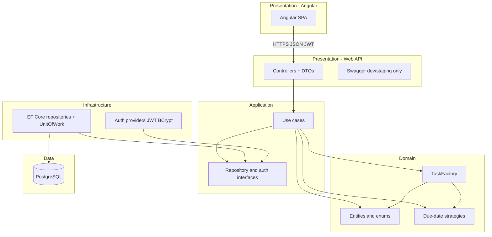

# Task Manager — Architecture

Technical architecture for the interview exercise: Clean Architecture, TDD, ADO.NET (Npgsql), Factory/Strategy patterns, JWT auth (OAuth/MFA-ready), and an Angular SPA.

## User story

> **As a Project Manager handling tight deadlines**, I want to **create and track tasks with automatic, priority-based rules**, **so that I can securely manage my daily workload and ensure high-urgency tasks are validated with stricter deadlines.**

## System context



## Clean Architecture layers

Dependencies point **inward** only. Outer layers depend on inner abstractions, never the reverse.

| Layer | Project | Responsibility | Depends on |
|-------|---------|----------------|------------|
| **Domain** | `TaskManager.Domain` | Business rules, `TaskItem`, Factory, Strategy, validation | Nothing |
| **Application** | `TaskManager.Application` | Use cases, DTOs/commands, repository and auth **interfaces** | Domain |
| **Infrastructure** | `TaskManager.Infrastructure` | EF Core (Npgsql), Repository + Unit of Work, JWT auth | Application |
| **Presentation (API)** | `TaskManager.Api` | Controllers, request/response DTOs, Swagger, JWT middleware | Application, Infrastructure (composition root) |
| **Presentation (UI)** | `client/` (Angular) | SPA, auth interceptor, task CRUD UI | Web API over HTTP |

```text
TaskManager.Api
    --> TaskManager.Application
    --> TaskManager.Infrastructure
            --> TaskManager.Application
                    --> TaskManager.Domain
```

The API references Infrastructure only to register DI at startup (composition root). Controllers must call **use cases**, not repositories directly.

## Design patterns

### Factory — validated task creation

`TaskFactory` is the **only** code path that instantiates `TaskItem` (`internal` constructor).

1. Validate title and user id.
2. Resolve due-date strategy by `TaskPriority`.
3. Run strategy against `createdAtUtc` (anchor for 48h / 1 year rules).
4. Return a valid entity with `StatusId = Todo` or throw `DomainValidationException`.

### Strategy — priority-based due dates

| Priority | Rule |
|----------|------|
| **High** | `dueDate` in the future and within **48 hours** of creation |
| **Standard / Low** | `dueDate` in the future and within **1 year** of creation |

`TaskValidationStrategyResolver` selects `HighPriorityDueDateStrategy` or `StandardLowPriorityDueDateStrategy`.

`ITaskDueDateValidator` wraps the resolver for **updates** (re-validate due date against the task's original `CreatedOn`). Registered via `AddDomain()` in [`DependencyInjection.cs`](src/TaskManager.Domain/DependencyInjection.cs).

### Authentication (extensible)

| Abstraction | MVP | Future |
|-------------|-----|--------|
| `IAuthenticationProvider` | Local email/password | OAuth providers |
| `IMfaService` | `NoOpMfaService` | TOTP / email OTP |
| `ITokenService` | JWT | Same after OAuth |

Login pipeline: resolve provider → validate credentials → check `IsActive` / `EndDate` → optional MFA → issue JWT → update `LastLoginDate`.

## Validation (two tiers)

| Tier | Where | Examples |
|------|-------|----------|
| **API contract** | Request DTOs with Data Annotations | `[Required]`, `[MaxLength]`, `[EmailAddress]` |
| **Business rules** | Domain Factory + Strategy | 48h window, non-empty title |

Do not duplicate priority/due-date rules in DTO annotations.

## Data model (PostgreSQL)

| Table | Purpose |
|-------|---------|
| `roles` | `RoleId` on users (ProjectManager, Admin) |
| `task_statuses` | `StatusId` on tasks (Todo, InProgress, Done) |
| `users` | Auth profile, audit columns, `mfa_enabled`, `last_login_date` |
| `tasks` | CRUD target; `user_id` scopes ownership |

All tables include audit columns: `created_by`, `created_on`, `updated_by`, `updated_on`.

Schema and seed data: [`db/init.sql`](db/init.sql).

## API surface

| Area | Routes | Auth |
|------|--------|------|
| Health | `GET /api/health` | Anonymous |
| Auth | `POST /api/auth/register`, `login` | Anonymous |
| Profile | `GET /api/me` | JWT |
| Tasks | `GET/POST/PUT/DELETE /api/tasks` | JWT |
| Lookups | `GET /api/task-statuses` | JWT |

Swagger: **Development / Staging only** (hidden in Production).

### Logging (Phase 3b — log4net)

- **Backend:** log4net + `ILogger<T>` bridge in `TaskManager.Api` ([`log4net.config`](src/TaskManager.Api/log4net.config))
- **Outputs:** console + rolling file under `logs/`
- **Middleware:** `ExceptionHandlingMiddleware` logs unhandled errors (500) and not-found (404)
- **Controllers:** targeted try/catch on `AuthController` login/register — log Warning with email + client IP, rethrow for HTTP mapping
- **Never log:** passwords, JWTs, connection strings

### Phase 4 — Task use cases (Application)

- `ITaskRepository`, `IUnitOfWork`, `ITaskStatusRepository` — EF implementations in Infrastructure
- `CreateTaskUseCase` → `ITaskFactory` (creation gate) + repository
- `UpdateTaskUseCase` → `ITaskDueDateValidator` anchored to `CreatedOnUtc`
- `GetTaskUseCase`, `ListTasksUseCase`, `DeleteTaskUseCase` with user isolation via `GetByIdForUserAsync` / `userId` filter
- `NotFoundException` for missing or other-user tasks (404 at API layer)

## Constraints (exercise compliance)

- **No** Dapper or MediatR.
- Data access: **EF Core** + Npgsql in Infrastructure only; Domain/Application stay ORM-free.
- **TDD:** xUnit, FluentAssertions, Moq.
- Frontend: **Angular** (see [`client/README.md`](client/README.md)).

## Phase delivery map

| Phase | Scope | Status |
|-------|--------|--------|
| **0** | Solution scaffold, Docker Postgres, `db/init.sql`, README | Done |
| **1** | Domain: Factory, Strategy, `TaskItem`, unit tests | Done |
| **2** | Priority strategies, `TaskDueDateValidator`, domain DI, boundary tests | Done |
| **3** | Auth use cases, JWT, Npgsql `IUserRepository`, OAuth/MFA stubs | Done |
| **3b** | log4net, `ExceptionHandlingMiddleware` logging, `AuthController` audit try/catch | Done |
| **4** | Task CRUD use cases, user isolation | Done |
| **5** | EF Core repositories, `IUnitOfWork`, persistence entities, integration tests | Done |
| **6** | API controllers, DTOs, Swagger, integration tests | Done |
| **7** | Angular SPA (auth, task CRUD, priority UX) | Done |
| **8** | Full `docker compose` (API + client), production Dockerfiles | Done |

## Frontend (Angular)

Standalone Angular 19 app in [`client/`](client/). Detailed notes: [`docs/FRONTEND-ARCHITECTURE.md`](docs/FRONTEND-ARCHITECTURE.md).

| Concern | Implementation |
|---------|----------------|
| Auth | `AuthService` + `TokenStorageService` (localStorage) |
| HTTP | `authInterceptor` attaches `Authorization: Bearer` |
| Routes | `/login`, `/register`, `/tasks`, `/tasks/new`, `/tasks/:id/edit` |
| Tasks | `TaskService` maps to `/api/tasks` and `/api/task-statuses` |
| Priority UX | Badge + due-date hints; High capped at 48h |
| Dev CORS | API `AngularDev` policy for `localhost:4200` |

**Ports:** UI `http://localhost:4200` (host dev) / **8083** (Docker nginx); API **8082**.

In Docker, nginx serves the SPA and proxies `/api` → `http://api:8080` ([`client/nginx.conf`](client/nginx.conf), [`Dockerfile.client`](Dockerfile.client)).

## Documentation roadmap

| Document | Purpose |
|----------|---------|
| [`ARCHITECTURE.md`](ARCHITECTURE.md) (this file) | Backend layers, patterns, phases |
| [`client/README.md`](client/README.md) | Angular setup and scripts |
| [`docs/FRONTEND-ARCHITECTURE.md`](docs/FRONTEND-ARCHITECTURE.md) | Routing, auth flow, DTO mapping |

## Testing strategy

| Layer | Tooling | Focus |
|-------|---------|--------|
| Domain | xUnit, FluentAssertions | Factory, strategies, boundary dates |
| Application | xUnit, Moq | Use cases with mocked ports |
| Infrastructure | xUnit, Testcontainers (optional) | SQL mapping, parameterized commands |
| API | `WebApplicationFactory` | HTTP status, auth, DTO vs domain validation |

## Local development

See root [`README.md`](README.md) for Docker, build, test, and demo credentials.

```powershell
# DB only (TDD)
docker compose up postgres -d
dotnet test

# Host dev
dotnet run --project src/TaskManager.Api/TaskManager.Api.csproj
cd client && npm install && npm start

# Full stack (demo)
docker compose up --build
# UI http://localhost:8083  |  Swagger http://localhost:8082/swagger
```
