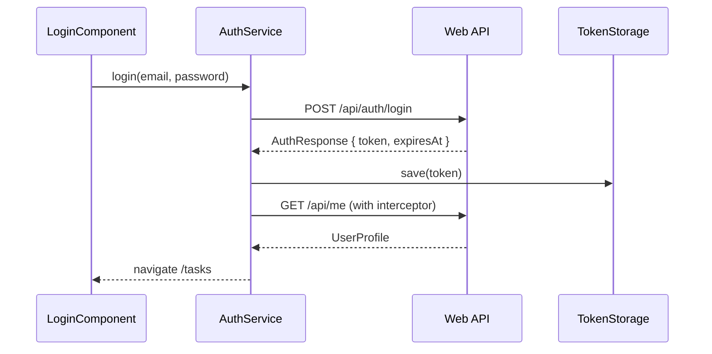

# Frontend architecture (Angular)

## Overview

The client is an Angular 19 standalone-component SPA that talks to the Task Manager Web API. Authentication uses JWT bearer tokens stored in `localStorage`. All task routes require a valid token.

## Folder structure

| Path | Responsibility |
|------|----------------|
| `core/models/` | TypeScript interfaces aligned with API DTOs |
| `core/services/` | `AuthService`, `TaskService`, `TokenStorageService` |
| `core/interceptors/` | `authInterceptor` — attaches JWT, handles 401 |
| `core/guards/` | `authGuard`, `guestGuard` |
| `core/utils/task-rules.ts` | Client-side due-date hints and limits (mirrors domain rules) |
| `features/auth/` | Login, register, OAuth callback stub |
| `features/tasks/` | Task board and create/edit form |
| `layout/app-shell/` | Header, nav, profile, sign out |
| `shared/` | Reusable UI (e.g. priority badge) |

## Routing

| Path | Guard | Component |
|------|-------|-----------|
| `/login` | guest | Login |
| `/register` | guest | Register |
| `/auth/callback` | — | OAuth stub |
| `/tasks` | auth | Task list |
| `/tasks/new` | auth | Create task |
| `/tasks/:id/edit` | auth | Edit task |
| `/` | auth | Redirect → `/tasks` |

## Auth flow

1. User submits credentials on `/login`.
2. `AuthService` posts to `/api/auth/login`; on success saves JWT via `TokenStorageService`.
3. `authInterceptor` adds `Authorization: Bearer {token}` to subsequent requests.
4. `AppShellComponent` loads `/api/me` for the header profile.
5. On **401** from a protected route, interceptor calls `logout()` and redirects to `/login`.

## Task CRUD flow

| UI action | HTTP |
|-----------|------|
| Board load | `GET /api/tasks` |
| Create | `POST /api/tasks` with `CreateTaskRequest` |
| Edit load | `GET /api/tasks/{id}` + `GET /api/task-statuses` |
| Save edit | `PUT /api/tasks/{id}` with `UpdateTaskRequest` |
| Delete | `DELETE /api/tasks/{id}` |

Domain validation (e.g. High priority beyond 48h) returns **400** with `{ "error": "..." }`; the form displays the message.

## DTO alignment

| API (C#) | TypeScript |
|----------|------------|
| `LoginRequest` | `LoginRequest` |
| `RegisterRequest` | `RegisterRequest` |
| `AuthResponse` | `AuthResponse` |
| `TaskResponse` | `TaskItem` |
| `CreateTaskRequest` | `CreateTaskRequest` |
| `UpdateTaskRequest` | `UpdateTaskRequest` |
| `TaskStatusResponse` | `TaskStatus` |

`TaskPriority` serializes as string enums (`"High"`, `"Standard"`, `"Low"`) matching `JsonStringEnumConverter` on the API.

## CORS and environments

- **Development:** API enables CORS for `http://localhost:4200` when `ASPNETCORE_ENVIRONMENT=Development`.
- **Development build:** `environment.development.ts` → `apiBaseUrl: 'http://localhost:8082'`.
- **Production build:** `environment.ts` → `apiBaseUrl: ''` for same-origin requests through nginx (`/api` proxy) in Phase 8.

## Design system

- Dark command-center aesthetic with teal accents and amber **High** priority emphasis
- Typography: **Fraunces** (headings), **IBM Plex Sans** (body)
- Global tokens in `src/styles.scss` (`--accent`, `--urgent`, etc.)
